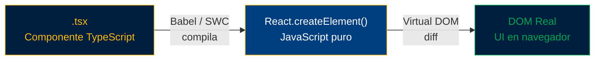
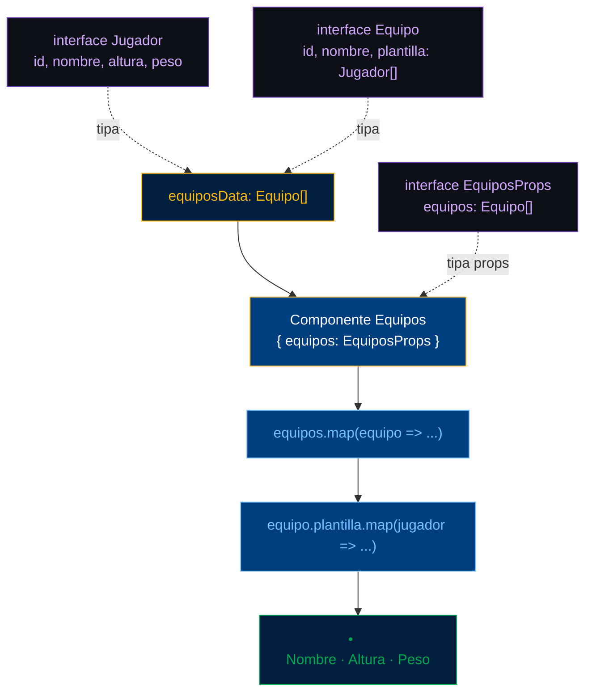
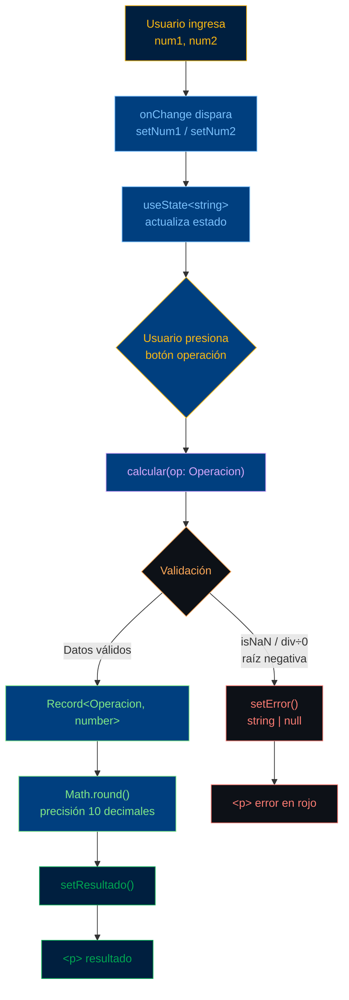
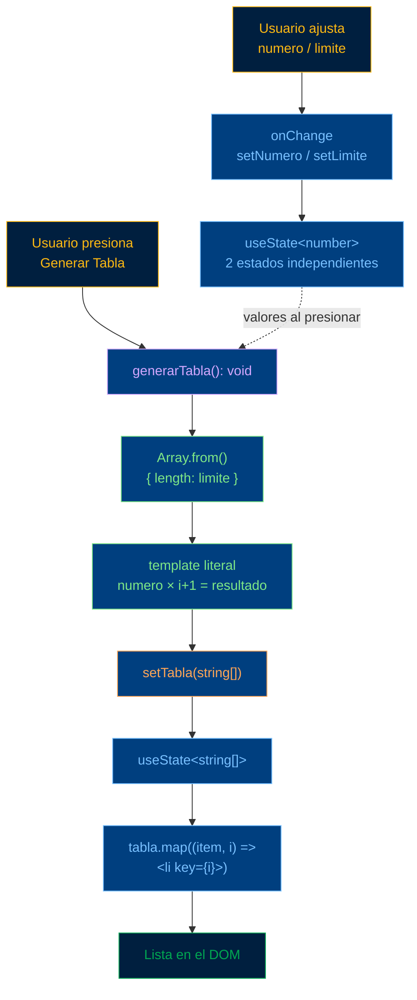

# Ejercicios React + TypeScript — DPS104
**Diseño y Programación de Software Multiplataforma · Ciclo II-2026**
Universidad Don Bosco · Ing. Rafael Alexander Torres Rodríguez, MGTR

---

## Ejercicio 1 — Hola Mundo: JSX Básico con TypeScript

> Renderizar un elemento JSX tipado con `JSX.Element` e interpolar expresiones dentro del marcado.

### Flujo del ejercicio



### src/app/page.tsx

```tsx
import styles from "./page.module.css";

const element: JSX.Element = (
  <>
    <h1>Hola, Mundo!</h1>
    <h2>Son las {new Date().toTimeString()}</h2>
  </>
);

export default function Home() {
  return (
    <main className={styles.main}>
      <div className="App">
        {element}
      </div>
    </main>
  );
}
```

### src/app/page.module.css

```css
/* Ejercicio 1 — Hola Mundo */
.main {
  min-height: 100vh;
  display: flex;
  flex-direction: column;
  align-items: center;
  justify-content: center;
  background: #f4f6f9;
  font-family: 'Inter', sans-serif;
}

.main h1 {
  font-size: 2.5rem;
  font-weight: 800;
  color: #003f7f;
  margin-bottom: 0.5rem;
}

.main h2 {
  font-size: 1.1rem;
  font-weight: 500;
  color: #5a6a7e;
  background: #fff;
  border: 1px solid #e2e8f0;
  border-left: 4px solid #fdb913;
  padding: 0.6rem 1.25rem;
  border-radius: 0 8px 8px 0;
  font-family: 'Fira Code', monospace;
}
```

### Notas clave
- `JSX.Element` es el tipo de retorno de cualquier bloque JSX/TSX.
- `<>...</>` es un **Fragment** — agrupa elementos sin agregar un nodo extra al DOM.
- `new Date().toTimeString()` es una expresión JavaScript válida dentro de `{}`.

---

## Ejercicio 2 — Equipos de Fútbol: Interfaces y Listas con `.map()`

> Definir interfaces TypeScript para datos estructurados y renderizar listas anidadas con `.map()`.

### Flujo del ejercicio



### src/app/page.tsx

```tsx
import styles from "./page.module.css";

interface Jugador {
  id: number;
  nombre: string;
  altura: string;
  peso: string;
}

interface Equipo {
  id: number;
  nombre: string;
  plantilla: Jugador[];
}

interface EquiposProps {
  equipos: Equipo[];
}

const Equipos = ({ equipos }: EquiposProps) => (
  <div className={styles.container__list}>
    <h2>Equipos de Fútbol</h2>
    {equipos.map((equipo: Equipo) => (
      <div key={equipo.id}>
        <h3>{equipo.nombre}</h3>
        <ul>
          {equipo.plantilla.map((j: Jugador) => (
            <li key={j.id}>
              <strong>{j.nombre}</strong> — {j.altura}m · {j.peso}
            </li>
          ))}
        </ul>
      </div>
    ))}
  </div>
);

const equiposData: Equipo[] = [
  {
    id: 1,
    nombre: "Real Madrid",
    plantilla: [
      { id: 1, nombre: "Vinicius Jr.", altura: "1.76", peso: "73Kg" },
      { id: 2, nombre: "Jude Bellingham", altura: "1.86", peso: "75Kg" },
      { id: 3, nombre: "Kylian Mbappé", altura: "1.78", peso: "73Kg" },
    ],
  },
  {
    id: 2,
    nombre: "Barcelona",
    plantilla: [
      { id: 1, nombre: "Lamine Yamal", altura: "1.80", peso: "67Kg" },
      { id: 2, nombre: "Robert Lewandowski", altura: "1.85", peso: "81Kg" },
      { id: 3, nombre: "Gavi", altura: "1.73", peso: "68Kg" },
    ],
  },
];

export default function Home() {
  return (
    <main className={styles.main}>
      <h1>Mi Aplicación de Fútbol</h1>
      <Equipos equipos={equiposData} />
    </main>
  );
}
```

### src/app/page.module.css

```css
/* Ejercicio 2 — Equipos de Fútbol */
.main {
  min-height: 100vh;
  background: #f4f6f9;
  font-family: 'Inter', sans-serif;
  padding: 2rem;
}

.main h1 {
  font-size: 1.8rem;
  font-weight: 800;
  color: #003f7f;
  border-bottom: 3px solid #fdb913;
  padding-bottom: 0.5rem;
  margin-bottom: 1.5rem;
}

.container__list {
  display: grid;
  grid-template-columns: repeat(auto-fill, minmax(280px, 1fr));
  gap: 1.25rem;
  max-width: 900px;
  margin: 0 auto;
}

.container__list h2 {
  grid-column: 1 / -1;
  font-size: 1.2rem;
  font-weight: 700;
  color: #001f3f;
  margin-bottom: 0.5rem;
}

.container__list div {
  background: #fff;
  border: 1px solid #e2e8f0;
  border-radius: 12px;
  padding: 1.25rem;
  box-shadow: 0 2px 8px rgba(0,63,127,.07);
}

.container__list h3 {
  font-size: 1rem;
  font-weight: 700;
  color: #003f7f;
  background: #e6f1fb;
  padding: 0.4rem 0.75rem;
  border-radius: 6px;
  margin-bottom: 0.75rem;
  border-left: 3px solid #fdb913;
}

.container__list ul {
  list-style: none;
  padding: 0;
  display: flex;
  flex-direction: column;
  gap: 0.5rem;
}

.container__list li {
  font-size: 0.85rem;
  color: #5a6a7e;
  padding: 0.4rem 0.5rem;
  border-bottom: 1px solid #f0f4f8;
}

.container__list li strong {
  color: #1a2332;
  font-weight: 600;
}
```

### Notas clave
- Cada elemento en `.map()` requiere `key` única — React la usa para el reconciliado del Virtual DOM.
- Las interfaces se definen **fuera** del componente para poder reutilizarlas en otros archivos.
- `Jugador[]` es la sintaxis TypeScript para un arreglo de objetos del tipo `Jugador`.

---

## Ejercicio 3 — Calculadora: `useState` Tipado y Manejo de Eventos

> Gestionar múltiples estados con `useState` genérico, usar un `type` de unión para las operaciones y manejar errores de forma tipada.

### Flujo del ejercicio



### src/app/page.tsx

```tsx
"use client";
import { useState } from "react";
import styles from "./page.module.css";

type Operacion = "suma" | "resta" | "multi" | "div" | "pot" | "raiz";

export default function Home() {
  const [num1, setNum1] = useState<string>("");
  const [num2, setNum2] = useState<string>("");
  const [resultado, setResultado] = useState<string | null>(null);
  const [error, setError] = useState<string | null>(null);

  const calcular = (op: Operacion): void => {
    setError(null);
    const a = parseFloat(num1);
    const b = parseFloat(num2);

    if (isNaN(a) || (isNaN(b) && op !== "raiz")) {
      setError("Ingrese números válidos"); return;
    }
    if (op === "div" && b === 0) {
      setError("Error: División por cero no permitida"); return;
    }
    if (op === "raiz" && a < 0) {
      setError("Error: Raíz de número negativo"); return;
    }

    const resultados: Record<Operacion, number> = {
      suma:  a + b,
      resta: a - b,
      multi: a * b,
      div:   a / b,
      pot:   Math.pow(a, b),
      raiz:  Math.sqrt(a),
    };

    setResultado(String(Math.round(resultados[op] * 1e10) / 1e10));
  };

  return (
    <main className={styles.main}>
      <div className={styles.calculadora}>
        <h2>Calculadora</h2>
        <input
          type="number"
          value={num1}
          onChange={(e: React.ChangeEvent<HTMLInputElement>) => setNum1(e.target.value)}
          placeholder="Número 1"
        />
        <input
          type="number"
          value={num2}
          onChange={(e: React.ChangeEvent<HTMLInputElement>) => setNum2(e.target.value)}
          placeholder="Número 2"
        />
        {(["suma", "resta", "multi", "div", "pot", "raiz"] as Operacion[]).map((op) => (
          <button key={op} onClick={() => calcular(op)}>{op}</button>
        ))}
        <button onClick={() => { setNum1(""); setNum2(""); setResultado(null); setError(null); }}>
          Limpiar
        </button>
        {resultado && <p>Resultado: {resultado}</p>}
        {error && <p className={styles.error}>{error}</p>}
      </div>
    </main>
  );
}
```

### src/app/page.module.css

```css
/* Ejercicio 3 — Calculadora */
.main {
  min-height: 100vh;
  display: flex;
  align-items: center;
  justify-content: center;
  background: #f4f6f9;
  font-family: 'Inter', sans-serif;
}

.calculadora {
  background: #fff;
  border: 1px solid #e2e8f0;
  border-radius: 16px;
  padding: 2rem;
  width: 100%;
  max-width: 420px;
  box-shadow: 0 4px 24px rgba(0,63,127,.1);
}

.calculadora h2 {
  font-size: 1.2rem;
  font-weight: 800;
  color: #003f7f;
  text-align: center;
  border-bottom: 3px solid #fdb913;
  padding-bottom: 0.75rem;
  margin-bottom: 1.25rem;
}

.calculadora input {
  width: 100%;
  padding: 0.65rem 1rem;
  border: 1px solid #e2e8f0;
  border-radius: 8px;
  font-family: 'Fira Code', monospace;
  font-size: 1rem;
  margin-bottom: 0.75rem;
  outline: none;
  transition: border-color .2s;
}

.calculadora input:focus {
  border-color: #003f7f;
  box-shadow: 0 0 0 3px rgba(0,63,127,.1);
}

.calculadora button {
  padding: 0.55rem 1rem;
  background: #003f7f;
  color: #fff;
  border: none;
  border-radius: 8px;
  font-family: 'Inter', sans-serif;
  font-size: 0.8rem;
  font-weight: 600;
  cursor: pointer;
  transition: background .2s;
  margin: 0.2rem;
}

.calculadora button:hover {
  background: #fdb913;
  color: #001f3f;
}

.calculadora p {
  margin-top: 1rem;
  text-align: center;
  font-size: 1.1rem;
  font-weight: 700;
  color: #003f7f;
  background: #e6f1fb;
  padding: 0.6rem;
  border-radius: 8px;
  font-family: 'Fira Code', monospace;
}

.error {
  color: #c0392b !important;
  background: #fdecea !important;
  border: 1px solid #f5c6c2 !important;
}
```

### Notas clave
- `"use client"` es obligatorio en Next.js 14 App Router cuando se usa `useState` o eventos del navegador.
- `Record<Operacion, number>` garantiza que el objeto tenga exactamente las 6 claves del tipo `Operacion`.
- `string | null` permite que el estado inicie en `null` y se diferencie de un string vacío.

---

## Ejercicio 4 — Tabla de Multiplicar: `useState` Múltiple y Arreglo Dinámico

> Manejar múltiples estados independientes y generar arreglos dinámicos con `useState<string[]>` usando `Array.from()`.

### Flujo del ejercicio



### src/app/page.tsx

```tsx
"use client";
import { useState } from "react";
import styles from "./page.module.css";

export default function Home() {
  const [numero, setNumero] = useState<number>(1);
  const [limite, setLimite]  = useState<number>(10);
  const [tabla, setTabla]    = useState<string[]>([]);

  const generarTabla = (): void => {
    const resultado = Array.from(
      { length: limite },
      (_, i) => `${numero} × ${i + 1} = ${numero * (i + 1)}`
    );
    setTabla(resultado);
  };

  return (
    <main className={styles.main}>
      <div className={styles.card}>
        <h2>Tabla de Multiplicar</h2>

        <div className={styles.controls}>
          <label>
            Número:
            <input
              type="number"
              value={numero}
              onChange={(e) => setNumero(parseInt(e.target.value) || 1)}
            />
          </label>
          <label>
            Límite:
            <input
              type="number"
              value={limite}
              onChange={(e) => setLimite(parseInt(e.target.value) || 10)}
            />
          </label>
          <button onClick={generarTabla}>Generar Tabla</button>
        </div>

        <ul>
          {tabla.map((item, i) => (
            <li key={i}>{item}</li>
          ))}
        </ul>
      </div>
    </main>
  );
}
```

### src/app/page.module.css

```css
/* Ejercicio 4 — Tabla de Multiplicar */
.main {
  min-height: 100vh;
  display: flex;
  align-items: center;
  justify-content: center;
  background: #f4f6f9;
  font-family: 'Inter', sans-serif;
  padding: 2rem;
  box-sizing: border-box;
}

.card {
  width: 100%;
  max-width: 640px;
  background: #ffffff;
  border-radius: 16px;
  padding: 2rem 2.25rem;
  box-shadow: 0 10px 30px rgba(0, 31, 63, 0.08);
}

.main h2 {
  font-size: 1.5rem;
  font-weight: 800;
  color: #003f7f;
  text-align: left;
  border-bottom: 3px solid #fdb913;
  padding-bottom: 0.6rem;
  margin: 0 0 1.5rem 0;
  display: inline-block;
}

/* Fila de controles: Número, Límite y botón alineados */
.controls {
  display: flex;
  align-items: end;
  gap: 1rem;
  flex-wrap: wrap;
  margin-bottom: 1.5rem;
}

.main label {
  display: flex;
  flex-direction: column;
  align-items: flex-start;
  gap: 0.4rem;
  font-size: 0.85rem;
  font-weight: 600;
  color: #1a2332;
  margin-bottom: 0;
}

.main input {
  padding: 0.55rem 0.75rem;
  border: 1px solid #e2e8f0;
  border-radius: 8px;
  font-family: 'Fira Code', monospace;
  font-size: 0.9rem;
  width: 80px;
  text-align: center;
  outline: none;
  background: #f8fafc;
}

.main input:focus {
  border-color: #003f7f;
  box-shadow: 0 0 0 3px rgba(0, 63, 127, .1);
  background: #fff;
}

.main button {
  padding: 0.65rem 1.5rem;
  background: #fdb913;
  color: #001f3f;
  border: none;
  border-radius: 8px;
  font-family: 'Inter', sans-serif;
  font-size: 0.9rem;
  font-weight: 700;
  cursor: pointer;
  transition: background .2s, transform .1s;
  white-space: nowrap;
  height: fit-content;
}

.main button:hover {
  background: #c9920e;
}

.main button:active {
  transform: scale(0.98);
}

.main ul {
  list-style: none;
  padding: 0;
  margin: 0;
  display: grid;
  grid-template-columns: repeat(2, 1fr);
  gap: 0.5rem;
}

.main li {
  background: #f8fafc;
  border: 1px solid #e2e8f0;
  border-radius: 8px;
  padding: 0.6rem 0.9rem;
  font-family: 'Fira Code', monospace;
  font-size: 0.88rem;
  color: #003f7f;
  font-weight: 500;
  text-align: center;
}

.main li:nth-child(even) {
  background: #e6f1fb;
}

/* Responsive */
@media (max-width: 480px) {
  .card {
    padding: 1.5rem;
  }
  .controls {
    flex-direction: column;
    align-items: stretch;
  }
  .main button {
    width: 100%;
  }
}
```

### Notas clave
- `Array.from({ length: n }, (_, i) => ...)` es el patrón idiomático para generar arreglos de longitud fija sin `for`.
- Los 3 estados son **independientes** — cambiar `numero` o `limite` no regenera la tabla, el estudiante debe presionar el botón.
- `parseInt(e.target.value) || 1` evita que el estado quede en `NaN` cuando el input está vacío.

---

## Resumen de patrones TypeScript usados

| Patrón | Ejercicio | Ejemplo |
|---|---|---|
| `JSX.Element` | Ej 1 | `const el: JSX.Element = <h1>...</h1>` |
| `interface` de props | Ej 2 | `interface EquiposProps { equipos: Equipo[] }` |
| Arreglo tipado | Ej 2 | `Jugador[]` |
| `useState<T>` genérico | Ej 3, 4 | `useState<string>("")` |
| `string \| null` | Ej 3 | `useState<string \| null>(null)` |
| `type` de unión | Ej 3 | `type Operacion = "suma" \| "resta" \| ...` |
| `Record<K, V>` | Ej 3 | `Record<Operacion, number>` |
| Tipo de evento | Ej 3 | `React.ChangeEvent<HTMLInputElement>` |
| Retorno `: void` | Ej 3, 4 | `const calcular = (op: Operacion): void => {}` |
| `useState<string[]>` | Ej 4 | `useState<string[]>([])` |

---

*DPS104 · Universidad Don Bosco · Ciclo II-2026*
